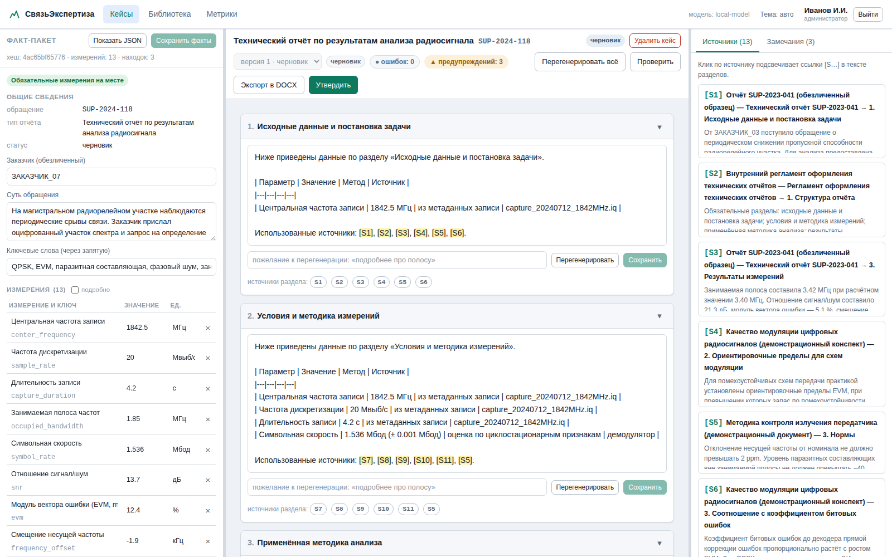

# 09. Приложение: сервер, интерфейс, роли

Документ описывает то, что реализовано в коде: веб-приложение, через которое
инженер ведёт входящее письмо — от регистрации до подписанного
ответа. Слой анализа сигналов (док. 06, этап 1) сюда пока не входит:
факт-пакет загружается готовым JSON-файлом или заполняется в интерфейсе
руками.

**О названиях.** В интерфейсе обращение называется письмом: пришло
входящее, на него готовится ответ. В базе, в API и в коде та же сущность
по-прежнему зовётся `case` — таблица `cases`, маршруты `/api/cases/…`.
Переименовывать её на работающей установке дороже, чем один раз объяснить
расхождение, поэтому дальше «письмо» и `case` — одно и то же.

## 9.1. Как это выглядит

Слева — боковое меню, справа шапка и содержимое во всю ширину монитора.
Прежний ограничитель в 1320 px убран: на 24-дюймовом экране треть площади
пустовала, а таблица писем и три панели отчёта жались в узкую колонку. Меню
сворачивается до значков, на узком экране прячется за кнопкой в шапке.

- **Дашборд** — что в отделе происходит сегодня (ниже в этом разделе).
- **Письма** — входящие обращения и подготовленные ответы (9.4).
- **Помощник** — разговоры с моделью по библиотеке (док. 12).
- **Библиотека** — документы, из которых берутся формулировки и ссылки (9.6).
- **Метрики** — объём работы и качество черновиков (9.5); внизу страницы
  администратору показывается журнал действий (9.8).
- **Сотрудники** — личный состав, должности, отдел и группа (9.3). Пункт меню
  виден только администратору.

Щелчок по имени в шапке открывает личный кабинет: что сделано лично вами и
смена собственного пароля. Рядом — значок модели (её имя в подсказке) и
переключатель темы.

Окно входа — отдельная страница со своим фоном: Земля из космоса, спутник и
луч на наземную станцию. Кадр лежит в поставке файлом `static/login-bg.jpg`
и собирается сценарием `tools/make_login_bg.py`, так что изолированная
машина ничего не скачивает. Свой снимок ставится без правки
настроек: положите `login-bg.jpg` (или `.png`, `.webp`) рядом с файлом
настроек, на который указывает `REPORTGEN_CONFIG`, — страница возьмёт его.

**Дашборд** отвечает на вопрос «что с отделом сегодня» — тот самый, который
задают начальнику первым. Все данные приходят одним запросом `GET /api/board`
(параметр `days` — глубина периода; в интерфейсе 7, 30, 90 или 365 дней).
Верхний ряд плиток: писем в работе, просрочено, горят в ближайшие три дня,
без исполнителя, человек в строю (с числом дежурных и отсутствующих), ответов
отправлено за период. Каждая плитка ведёт в «Письма» с уже выбранным набором.
Ниже четыре карточки:

- **Нагрузка и занятость** — по каждому сотруднику: сколько писем ведёт,
  сколько из них просрочено и горит, ближайший срок, отпуск или дежурство;
- **Письма по состояниям** — сколько писем в каждом состоянии;
- **Сроки** — списки «просрочено» и «ближайшие три дня» со ссылками на письма
  и фамилиями исполнителей;
- **Дежурство и отсутствия** — кто сегодня дежурит и кого нет на месте;
  кнопка «Отметить дежурство или отпуск» видна администратору.

Отсутствия живут в отдельной таблице `absences`: дежурство, отпуск,
больничный, командировка, учёба. Отдельная таблица, а не пара колонок в
`users`, потому что у человека бывает несколько периодов и нужна история.
Читать их может любой сотрудник (`GET /api/absences`), заводить и удалять —
администратор (`POST /api/absences`, `DELETE /api/absences/{absence_id}`).



Слева — факт-пакет с измерениями и находками, в центре — отчёт по секциям с
кнопками перегенерации у каждой, справа — источники, на которые сослалась
модель, и замечания верификатора. Снимок сделан до перехода на боковое меню:
состав трёх панелей с тех пор не менялся, а ленты вкладок сверху больше нет.

Название компании, подзаголовок и акцентный цвет берутся из настроек
(`brand_name`, `brand_subtitle`, `brand_accent`, `brand_logo`), так что
интерфейс выглядит как ваш, а не как чужой.

## 9.2. Состав

```
┌──────────────────────────── браузер инженера ─────────────────────────────┐
│  боковое меню разделов | содержимое во всю ширину окна                    │
└───────────────────────────────────┬───────────────────────────────────────┘
                                    │ REST, cookie-сессия
┌───────────────────────────────────▼───────────────────────────────────────┐
│ FastAPI (src/reportgen/web)                                               │
│   api.py       — маршруты, права доступа                                  │
│   service.py   — бизнес-логика (генерация, правки, проверка, приёмка)     │
│   assistant.py — разговоры с помощником (док. 12)                         │
│   auth.py      — сессии, должности, защита от перебора паролей            │
└───────┬───────────────────────────────────────────────┬───────────────────┘
        │                                               │
┌───────▼───────────────┐                   ┌───────────▼───────────────────┐
│ SQLite (store/)       │                   │ Ядро (stdlib-only)            │
│  письма (cases),      │                   │  facts / pipeline / verify    │
│  отчёты, секции,      │                   │  retrieval / corpus / prompts │
│  библиотека, векторы, │                   └───────────┬───────────────────┘
│  разговоры, датасет,  │                               │
│  отсутствия, журнал   │                   ┌───────────▼───────────────────┐
└───────────────────────┘                   │ llama.cpp / vLLM (OpenAI API) │
                                            └───────────────────────────────┘
```

Одна база SQLite на установку. Внешних сервисов нет: ни очередей, ни Redis,
ни отдельной векторной БД. Для отдела на 3–10 инженеров этого достаточно, а
резервная копия — один файл.

## 9.3. Должности и права

Вход — по паролю, сессия живёт в cookie. В cookie лежит случайный токен на
256 бит, а не подписанные данные: сама сессия хранится строкой в таблице
`sessions`, и подписывать в ней нечего. Отсюда и способ погасить доступ —
удалить строку: это делают выход, смена пароля и отключение сотрудника. Срок
жизни задаёт `session_ttl_hours` (по умолчанию 12 часов).


Роли `viewer`, `engineer` и `admin` заменены штатными должностями отдела:
инженеру не приходится держать в голове вторую систему понятий, а
руководителю видно, кто есть кто.

| Должность | В коде | Права сверх общих |
|---|---|---|
| Создатель системы | `owner` | Все. Отключить и разжаловать нельзя никому |
| Начальник отдела | `head` | Администратор |
| Заместитель начальника отдела | `deputy` | Администратор |
| Начальник группы | `lead` | Администратор |
| Старший инженер отдела | `senior` | — |
| Инженер отдела | `engineer` | — |

Общие права есть у всех шести должностей: вести письма, править факт-пакет,
генерировать, править и утверждать отчёты, пополнять библиотеку и запускать
переиндексацию, искать по литературе, спрашивать помощника. Должности
«только на чтение» больше нет.

Права администратора — у первых четырёх должностей, до начальника группы
включительно. Это: заводить, править и отключать сотрудников, отмечать
дежурства и отсутствия, удалять письма и документы, читать журнал действий.
У сотрудника появились поля «отдел» и «группа» — без них дашборд не может
показать ни списочный состав, ни нагрузку по группам.

Правила, которые проверяет `api.py`:

- менять запись, сбрасывать пароль и отключать можно только сотрудника
  младше себя по должности; создателя системы — никому и никогда, иначе
  установка останется без владельца, а чинить это на изолированной машине
  нечем;
- назначить должность выше собственной нельзя;
- создателя системы через интерфейс не завести — «создатель системы в
  единственном числе»; для этого есть командная строка;
- отключить самого себя нельзя;
- свою карточку (ФИО, отдел, группа) администратор правит сам, свою
  должность — нет.

При обновлении базы прежние роли переносятся автоматически: первый по счёту
администратор (кроме служебной записи `local`) становится создателем системы,
остальные `admin` — начальниками отдела, `viewer` — инженерами. Прав никто не
теряет: разбираться, почему после обновления не открывается раздел
сотрудников, пришлось бы на изолированной машине без разработчика. Отметка о
переносе кладётся в таблицу `meta` под ключом `roles_migrated_at`.

Тем же проходом чинится отправитель писем: номер остаётся, название
организации стирается и дописывается в примечание к письму («Отправитель до
обновления: …»). Без этого факт-пакет старого письма не проходит проверку, и
черновик по нему не построить. Цифры из названия не выдёргиваются. Отметка —
`senders_migrated_at` в той же таблице `meta`.

Первого сотрудника заводят на самой машине:

```bash
reportgen useradd --login admin --role owner --name "Иванов И. И." \
    --department "Отдел радиоконтроля" --team "Группа измерений"
```

Пароль спросят в диалоге, если не задан `--password`; короче 8 знаков не
принимается. Список заведённых — `reportgen users`, смена пароля —
`reportgen passwd --login <логин>`.

При `REPORTGEN_AUTH_ENABLED=false` система работает в локальном режиме от
имени встроенной записи `local` с правами создателя системы — это для
одиночной установки на рабочей станции. Запись помечена неактивной, войти под
ней нельзя, даже если позже включить аутентификацию. В сетевой установке
выключать аутентификацию нельзя: в письмах лежат данные заказчиков.

## 9.4. Путь одного письма

Раздел «Письма» открывается набором «В работе»; рядом — «Просроченные», «Мои»
(где вы исполнитель), «Отправленные» и «Все», справа поиск по входящему
номеру, теме и заказчику. В таблице: входящий номер, тема, заказчик,
исполнитель, срок ответа, состояние, дата письма. Срок подсвечивается, когда
он уже прошёл или до него осталось не больше двух дней.

Карточка письма (кнопка в строке списка или «Карточка письма» на экране
самого письма) правит входящий номер, дату письма, заказчика, срок ответа,
исполнителя, приоритет — обычный, важный, срочный, — состояние и примечание.
Список сотрудников для выбора исполнителя читается из `/api/users`, а этот
маршрут открыт только администраторам: инженер карточку откроет, но
исполнителя в ней не сменит.

1. **Зарегистрировать письмо** — входящий номер и дата, заказчик, срок
   ответа, приоритет, исполнитель, тип отчёта и факт-пакет (JSON из слоя
   анализа либо заполненный руками). Система сразу проверяет факт-пакет по
   схеме и показывает `coverage` — каких обязательных измерений не хватает по
   шаблону.
2. **Сгенерировать** — конвейер проходит секции шаблона, для каждой подбирает
   фрагменты библиотеки и пишет текст. Результат сохраняется как версия отчёта
   вместе с использованными источниками.
3. **Проверить** — верификатор пересчитывает замечания: числа мимо
   факт-пакета, ссылки в никуда, недостающие разделы, запрещённые
   формулировки, термины мимо глоссария.
4. **Править** — инженер редактирует секции, перегенерирует отдельные разделы
   (можно с пожеланием: «подробнее про полосу»), возвращает черновик модели,
   если правка не удалась. Любая правка немедленно пересобирает Markdown
   отчёта и перезапускает проверку.
5. **Утвердить** — кнопка заблокирована, пока есть хотя бы одна ошибка уровня
   `error`. При утверждении система сохраняет пары «черновик модели → финал
   инженера» в обучающий набор (док. 03, 3.7).
6. **Экспортировать** — кнопка «Экспорт в DOCX» собирает документ по
   фирменному шаблону. Тот же отчёт в Markdown отдаёт
   `GET /api/reports/{report_id}/export.md`; кнопки для него в интерфейсе нет.

Состояния письма: принято → в работе → на проверке → отправлено → в архиве.
Два перехода система делает сама: генерация переводит письмо в «в работе»,
утверждение отчёта — в «отправлено». «На проверке» и «в архиве» ставит человек
в карточке — система не знает, ушёл ли ответ на подпись и закрыт ли вопрос у
заказчика.

Версии отчёта не перезаписываются: повторная генерация создаёт версию 2, 3 и
так далее, старые остаются доступны. Правка факт-пакета перепроверяет все
версии письма и снимает подпись с тех, где числа разошлись с новыми исходными
данными.

## 9.5. Что именно попадает в обучающий набор

При утверждении для каждой изменённой секции сохраняется:

- `draft` — что написала модель;
- `final` — что подписал инженер;
- `context` — факты и источники, которые модель видела (чтобы пример был
  самодостаточным и его можно было переиграть);
- `edit_distance` — нормированное расстояние правки в [0, 1];
- хеш факт-пакета и тип отчёта.

Выгрузка: `reportgen dataset --out var/dataset --kind sft` (или `--kind dpo`).
В разделе «Метрики» показаны средняя доля правки по всем парам и таблица
«какие разделы правят чаще всего» — это главные цифры для руководства.
Разбивки по неделям в коде нет; движение за период (сколько писем поступило,
сколько ответов отправлено, сколько версий отчётов собрано) показывает
дашборд.

## 9.6. Библиотека

Документы кладутся в `library/<тип>/…` либо загружаются через интерфейс.
Встроенно читаются PDF, DOCX, Markdown и TXT; остальные форматы — DJVU, ODT,
старые `.doc`, архивы, сканы через распознавание — подключаются
дополнительными пакетами, и что доступно именно на этой машине, видно в
разделе «Библиотека» и в `GET /api/formats` (док. 17). Конвертация в Markdown,
нарезка на чанки и индексация выполняются при загрузке и по кнопке
«Переиндексировать». Индексация инкрементальная — файл с неизменившимся
SHA-256 пропускается.

Лексический поиск работает всегда (FTS5 по стеммированному тексту). Плотный
поиск и реранкер включаются настройками `REPORTGEN_EMBED_ENABLED` и
`REPORTGEN_RERANK_ENABLED`, когда рядом поднят сервер эмбеддингов; векторы
строятся командой `reportgen embed`.

Поле «гриф» убрано: его не спрашивают при загрузке, не показывают в карточке
документа и не принимают через API. Колонка `confidentiality` в таблице
`documents` осталась от прежней версии, никем не читается и заполняется
значением по умолчанию — удалять колонку на работающей установке незачем.

## 9.7. Как добавить новый тип отчёта

Кода не требуется:

1. Создать `templates/outline_<тип>.json` по образцу существующих.
2. Перезагрузить страницу — шаблон подхватится автоматически (библиотека
   шаблонов перечитывает каталог при изменении файлов).
3. Убедиться, что ключи в `required_facts` совпадают со словарём ключей
   измерений (док. 08) — иначе `coverage` будет ругаться всегда.

Шаблон пишет старший инженер, а не разработчик. Это главный рычаг качества:
структура отчёта и инструкции секций влияют на результат сильнее, чем модель.

## 9.8. Журнал действий

Пишутся: входы и неудачные попытки входа; регистрация письма, правка его
карточки и факт-пакета, удаление; генерация, перегенерация и правка секций,
возврат черновика модели, утверждение отчёта и снятие подписи при изменении
фактов; экспорт в DOCX; загрузка, переиндексация, смена актуальности и
направления, удаление документов; заведение, правка, смена пароля и отключение
сотрудников; отметки дежурств и отсутствий; вложения к вопросу помощнику и
удаление разговора. У записи есть время, пользователь, объект и подробности.

Журнал доступен администратору через `/api/audit` и внизу раздела «Метрики».

Это требование док. 07: отчёт подписывает человек, и должно быть видно, кто
что делал и когда.

## 9.9. Ограничения текущей версии

Честный список того, чего в коде нет:

- **Нет слоя анализа сигналов и дампов** — факт-пакет приходит извне
  (это следующий этап, док. 06, этап 1).
- **Волновая генерация вместо полностью параллельной**: секции идут группами по
  `llm_parallel_sections`, потому что каждая следующая волна видит краткое
  содержание предыдущих. Полностью параллельная генерация была бы быстрее, но
  разделы начали бы повторять друг друга.
- **Нет фоновой очереди задач**: генерация идёт в HTTP-запросе. При отчёте на
  30 страниц это минуты — интерфейс показывает индикатор, таймаут прокси нужно
  поднять (см. `deploy/nginx.conf`).
- **Проверка на противоречия «выводы ↔ измерения» LLM-судьёй** описана в
  док. 04, но в коде не включена: она удваивает время генерации, включать
  стоит после того, как накопится статистика по реальным ошибкам.
- **Графики (спектрограмма, созвездие)** в отчёт не вставляются — их даёт
  слой анализа, которого пока нет.
- **Состояние письма не следит за сроком**: просрочку видно в списке и на
  дашборде, но само письмо никуда не переходит и никого не оповещает — почты
  и внешних служб в изолированном контуре нет.
