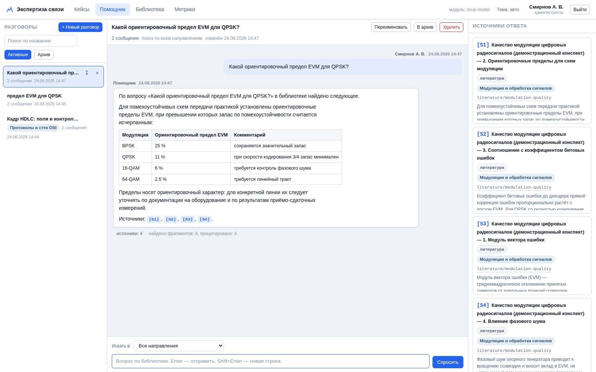
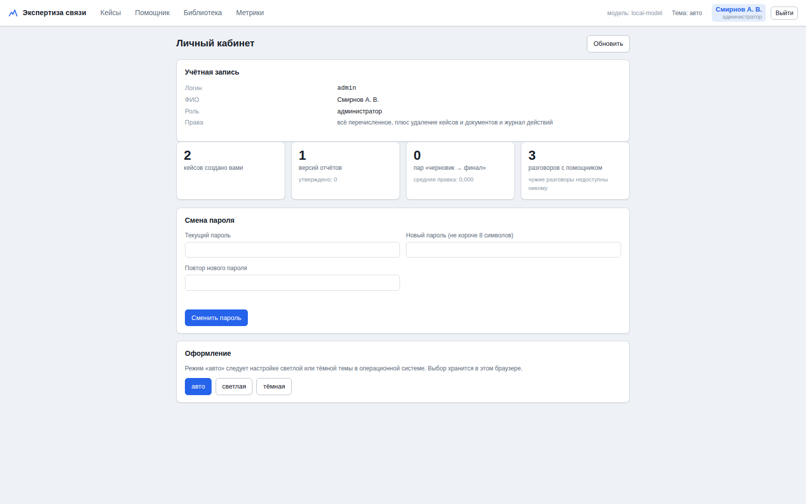

# 12. Помощник: вопросы по библиотеке

Второй режим работы системы. Отчёты — это конвейер: факт-пакет на входе,
подписанный документ на выходе. Помощник — это рабочий разговор: «какой предел
EVM для QPSK», «что означает поле в кадре HDLC», «какая методика применима при
измерении занимаемой полосы». Оба режима стоят на одной библиотеке, но
дисциплина у них разная.

Раздел открывается пунктом «Помощник» в боковом меню. Экран разделён на три
панели: список разговоров, переписка, источники ответа. При ширине окна
меньше 1280 px они не помещаются рядом, и над ними появляются кнопки
«Разговоры / Переписка / Источники».

## 12.1. Разница в дисциплине

| | Отчёт | Помощник |
|---|---|---|
| Откуда числа | **Только из факт-пакета.** Всё остальное — ошибка, экспорт блокируется | Только из найденных фрагментов, с ссылкой [S<N>] |
| Что делает модель, когда данных нет | Пишет `[ТРЕБУЕТ ПРОВЕРКИ: …]` | Пишет «В библиотеке ответа нет» и может пояснить из общего знания — **с явной пометкой** |
| Кто отвечает за результат | Инженер, который подписал | Инженер, который прочитал |
| Проверка | Верификатор, блокирующий утверждение | Ссылки и счётчик «найдено / процитировано» |

Ключевое: помощник **обязан** различать «это из вашей библиотеки, вот ссылка»
и «в библиотеке нет, поясняю по общей подготовке». Универсальный помощник,
который на любой вопрос уверенно отвечает по памяти, для технической
экспертизы опаснее, чем полезен: номер пункта стандарта, названный по памяти,
выглядит ровно так же, как настоящий. Правило зашито в системную инструкцию
(`prompts.ASSISTANT_SYSTEM_PROMPT`, пункты 1–3).

## 12.2. Приватность

Разговор принадлежит одному пользователю. Чужой чат недоступен **никому,
включая администратора**: в вопросах инженеров всплывают входящие номера
писем, названия объектов и параметры линий заказчиков — то же, что и в самих
письмах (док. 07).

Технически: любой запрос к чужому чату отдаёт **404, а не 403** — само
существование чужого разговора не раскрывается. В журнале действий остаётся
факт обращения (`chat.ask` со счётчиками «найдено» и «процитировано»),
приложения файла (`chat.attach` — имя и размер) и удаления разговора, но не
содержание вопроса, ответа и самого файла. Обезличенные счётчики (сколько
всего разговоров, сообщений, скольких человек они касаются) база считать
умеет — `ChatRepo.stats`, — но в разделе «Метрики» их сейчас нет.

## 12.3. Как собирается материал для модели

1. **Запрос к поиску** — текст вопроса плюс предыдущий вопрос инженера.
   Второе обязательно: «а для 16-QAM?» без контекста не находит ничего. Если
   к вопросу приложены файлы, к запросу добавляется до 40 разных слов из их
   начала (см. 12.5). Собранный запрос обрезается до 1400 знаков.
2. **Фильтр по направлению**, если он выбран в разговоре: коротковолновая
   связь, спутниковые и радиорелейные линии, мобильные сети, протоколы и стек
   OSI, обработка сигналов, методики и измерения, специальное ПО,
   аппаратно-программные комплексы, стандарты связи, прочее. Список задаётся
   в `templates/domains.json`. Отсекается в SQL и в плотном канале
   одновременно — см. док. 13.
3. **Фрагменты** — `assistant_top_k`, по умолчанию 12. Для разговора их берут
   больше, чем для раздела отчёта: там материал ограничен факт-пакетом, здесь
   — только вопросом. Если значение обнулить, берётся `retrieval_top_k`.
   Каждый фрагмент показывается модели до `assistant_source_chars` знаков
   (2200). Значение подобрано под нарезку корпуса — `TARGET_CHARS` в
   `corpus.py` тоже 2200, то есть фрагмент обычно доходит до модели целиком.
4. **Соседние куски.** К первым `assistant_neighbour_top` фрагментам (4)
   подтягивается по `assistant_neighbours` кусков того же документа с каждой
   стороны (1). Найденный фрагмент вырезан из документа механически: таблица
   допусков или описание поля кадра в него не помещаются — начало осталось в
   предыдущем куске, конец в следующем, и модель отвечала по середине.
   Соседу отводится половина меры фрагмента (но не меньше 300 знаков), а
   сосед, который и сам попал в выдачу, не подставляется второй раз: тот же
   текст занимал бы окно дважды. В промпте соседи помечены как «предыдущий /
   следующий фрагмент документа», чтобы модель не выдавала их за найденное.
5. **Карта библиотеки.** Перед источниками модель получает перечень
   документов, из которых взяты фрагменты: название, тип, год, актуальность
   (действующий, заменён, выведен из обращения, проект), метки своих
   фрагментов и, если включено `assistant_outlines`, оглавление — до 30
   заголовков разделов. Оглавление позволяет ответить «порог должен быть в
   разделе 5.2 того же документа, во фрагменты он не попал» вместо «в
   источниках этого нет».
6. **Порядок.** Фрагменты идут в промпте группами по документам, а не
   вперемешку по весу: сопоставить стандарт с паспортом микросхемы можно,
   только когда они не перемешаны. Системная инструкция прямо требует сверить
   документы между собой и назвать оба значения, если они расходятся.
7. **История** — до шести последних сообщений, каждое обрезано до 1500
   символов; они уходят модели отдельными репликами, а не внутри задания.
8. **Ответ** приходит потоком: сначала вопрос, потом источники, потом текст
   по мере генерации. Источники видны раньше, чем модель дописала первое
   предложение, — это заметно меняет ощущение от работы.
9. **В историю сохраняются только процитированные источники.** Если модель
   сослалась на два фрагмента из двенадцати, в панели останутся два: иначе
   панель заполняется мусором и перестаёт читаться. Если не сослалась ни на
   один — сохраняются первые три, чтобы было видно, что вообще нашлось.

Переводы строк во фрагментах сохраняются. Это не косметика: таблицы допусков
в стандартах и описания полей кадров — как раз то, ради чего фрагмент нашли,
а схлопнутые в строку они нечитаемы и для модели, и для инженера.

Длина вопроса ограничена 4000 знаками: более длинный текст — это уже
приложенный файл, а не вопрос (12.5).

## 12.4. Бюджет окна контекста

Весь материал — карта библиотеки, источники с соседями и приложенные файлы —
складывается в промпт, а промпт обязан поместиться в окно модели. Арифметика,
из которой получены значения по умолчанию:

| Что | Сколько |
|---|---|
| Окно `llama-server` при `-c 32768 --parallel 2` | 16384 токена на разговор |
| Ответ (`assistant_max_tokens`) | 4000 |
| Системная инструкция | ~900 |
| История разговора | ~600 |
| Остаётся под материал | ~10800 токенов ≈ 26 000 знаков |

Отсюда `assistant_context_chars` = 26000: при этой токенизации русский текст
идёт примерно по 2,4 знака на токен. Материал обрезается по этой границе — по
одному источнику с конца выдачи, где уже хвост относимости; первый источник
остаётся всегда, иначе отвечать было бы не на чем.

Границу приходится держать самим, потому что **переполнение llama.cpp
обрабатывает молча**: он выбрасывает начало промпта вместе с системной
инструкцией. Модель перестаёт ставить ссылки [S<N>], начинает округлять числа
и отвечать по памяти. Со стороны это выглядит как «модель поглупела», а
причина — в переполненном окне. Поэтому: уменьшили `-c` у llama-server —
уменьшайте и `assistant_context_chars`.

## 12.5. Файлы, приложенные к вопросу

Кнопка «Приложить файл» под полем ввода: дамп, лог, снимок экрана, документ.
Смысл в том, чтобы разбирать данные с объекта, а библиотеку использовать для
объяснения увиденного и ссылки на норму.

- **Что читается.** Текстовые дампы и логи (`.txt`, `.log`, `.csv`, `.json`,
  `.xml`, `.har`), снимки экрана (PNG, JPG, TIFF, BMP), документы (PDF, DOCX,
  XLSX, ODT, Markdown). Разбор делает тот же конвертер, что и приём
  библиотеки (док. 17). Сверх его списка помощник читает как обычный текст
  то, что инженер приносит в разговор постоянно: `.log`, `.json`, `.har`,
  `.ini`, `.conf`, `.cfg`, `.yaml`, `.yml`, `.out`; кодировка определяется
  так же, как для `.txt`, — логи с изолированной машины приходят и в UTF-8,
  и в cp1251. Незнакомый файл не роняет вопрос: он приложится с пометкой,
  что текста в нём нет.
- **Снимок экрана распознаётся, а не рассматривается.** Картинка проходит
  через tesseract, модели уходит распознанный текст. Нет tesseract — файл
  приложится пустым, с предупреждением; ошибки не будет.
- **Двоичный `.pcap` не разбирается.** На `.pcap`, `.pcapng` и `.cap` система
  отвечает подсказкой: нужен текстовый экспорт из Wireshark
  («Файл → Экспортировать пакеты → Как обычный текст»).
- **Файл живёт в базе, а не на диске.** Он разбирается сразу при загрузке,
  текст остаётся в разговоре, копия файла удаляется: каталог загрузок иначе
  растёт от каждого заданного вопроса. Предел размера — общий с приёмом
  библиотеки (`max_upload_mb`, по умолчанию 200 МБ).
- **В промпт идёт начало файла** — `assistant_attachment_chars` знаков (8000)
  на каждый приложенный файл. Дамп на десятки мегабайт в окно не поместится
  никогда, а в начале лежат заголовки сессии и первые ошибки, по которым
  обычно и понятно, что случилось. Об обрезке модели сказано прямо — иначе
  она сделает вывод «ошибок больше нет» по обрезанному хвосту.
- **Вложения тратят то же окно, что и библиотека.** Из бюджета 12.4
  вычитается вес приложенных файлов, но библиотеке в любом случае остаётся не
  меньше 6000 знаков: без источников помощник превращается в обычную модель
  без ссылок на нормы.
- **Числа из файла — измерения, а не источник.** Ссылку [S<N>] на них модель
  не ставит: в задании сказано указывать, из какого файла взято значение.
- **Файлы ждут вопроса.** Приложенное висит у разговора, пока вопрос не
  отправлен, и переживает уход из раздела; отправленный вопрос показывает
  свои файлы под собой, чтобы через неделю было понятно, откуда в ответе
  взялись эти числа. Крестик на плашке убирает файл до отправки.

Маршруты: `POST /api/chats/{id}/attachments` (загрузка) и
`DELETE /api/chats/{id}/attachments/{id}` (убрать).

## 12.6. Привязка разговора к письму

Кнопка «Спросить помощника» на экране письма создаёт разговор, привязанный к
обращению. В контекст модели тогда добавляются шапка письма (номер обращения,
заказчик, оборудование, суть обращения, полученные материалы) и таблица
измерений из факт-пакета — можно спрашивать «почему EVM такой при этом ОСШ» и
получать ответ с оглядкой на конкретные цифры этого письма. Если факт-пакет
пуст или испорчен, блок просто не добавляется, разговор при этом работает.

Привязка не превращает разговор в отчёт: числа из факт-пакета помощник видит,
но подписанный документ из разговора не рождается.

В базе и API письмо по-прежнему называется `case`: привязка передаётся полем
`case_ref`, карточка тянется с `/api/cases/{id}`. Раздел переименован в
«Письма», а таблица и маршруты остались прежними — переименовывать их на
работающей установке дороже, чем объяснить это здесь.

## 12.7. Что не теряется

- **Уход в другой раздел не обрывает ответ.** Генерация продолжается, текст
  копится, и, вернувшись в «Помощник», инженер видит ответ дописанным.
- **Недописанный вопрос сохраняется** в браузере — отдельно по каждому
  разговору — и возвращается в поле ввода при следующем заходе.
- **Раздел открывается там, где вы были:** на последнем разговоре. Если его
  удалили, система об этом скажет и покажет список.
- **Прерванный ответ не пропадает.** Кнопка «Стоп» или закрытая вкладка
  обрывают поток, но написанное до этого момента сохраняется в разговоре с
  пометкой «Ответ прерван» — минута работы модели не пропадает бесследно.
- **Название разговора** система ставит сама по первому вопросу; разговор,
  открытый из письма, называется по его номеру. Переименовать можно вручную.

## 12.8. Что помощник не делает

- Не заменяет отчёт и не является документом для заказчика.
- Не подтверждает числа и номера пунктов по памяти — только цитатой.
- Не даёт коммерческих оценок, не рекомендует конкретные модели к покупке,
  не делает выводов о виновной стороне.
- Не видит чужие разговоры и не помнит их содержание между пользователями.

## 12.9. Хорошие и плохие вопросы

| Вопрос | Оценка | Почему |
|---|---|---|
| «Какой ориентировочный предел EVM для QPSK при FEC 3/4?» | хороший | Конкретный параметр, конкретная схема — поиск находит нужный раздел |
| «Что означает поле Control в кадре HDLC?» | хороший | Термин есть в библиотеке, ответ будет с цитатой |
| «Почему у нас всё плохо с сигналом?» | плохой | Нечего искать; помощник задаст уточняющий вопрос |
| «Сделай отчёт по письму 118» | плохой | Это работа конвейера отчётов, а не разговора |
| «Какая норма на паразитные составляющие?» | средний | Уточните, для какой линии и по какому документу — иначе найдётся не та методика |
| «А для 16-QAM?» (после вопроса про QPSK) | хороший | Контекст подхватывается из предыдущего вопроса |
| «Что не так в этом логе?» с файлом | хороший | Разбирается файл, а библиотека объясняет увиденное |

## 12.10. Как понять, что ответу нельзя доверять

- **Нет ни одной ссылки [S<N>]** — ответ построен не на библиотеке.
- **Есть пометка «общее знание, вашей библиотекой не подтверждено»** — это
  честное предупреждение, а не формальность: проверьте по документу.
- **Под ответом нет строки со счётчиком, а панель источников пуста** — поиск
  не нашёл ничего, и опереться модели было не на что.
- **`найдено фрагментов: N в M док., процитировано: 0`** — фрагменты нашлись,
  но модель ими не воспользовалась: обычно значит, что нашлось не то.
  Уточните вопрос или выберите направление. В панели источников в этом случае
  показаны первые три фрагмента — это то, что нашёл поиск, а не то, чем
  пользовалась модель.
- **Предупреждение о деградации поиска** (сервер эмбеддингов или реранка
  недоступен) — работает только лексический поиск, качество ниже обычного.
  Предупреждение показывается в панели источников, пока открыт этот ответ; в
  переписке оно не сохраняется.

## 12.11. Личный кабинет

Учётная запись (логин, ФИО, должность, отдел и группа, перечень прав), сводка
по своей работе — письма, версии отчётов, пары «черновик → готовое» со
средней долей правки, разговоры, — смена пароля и выбор оформления. Средняя
правка — это ваш личный срез главной метрики системы из док. 05: чем она ниже,
тем меньше приходится переписывать за моделью.

Смена пароля закрывает все прочие сессии этого сотрудника, а текущая выдаётся
заново: если пароль меняют из-за того, что он куда-то утёк, оставлять чужой
открытый сеанс бессмысленно.

## 12.12. Настройки

| Ключ | Что меняет |
|---|---|
| `assistant_top_k` | Сколько фрагментов ищется для разговора (12) |
| `assistant_source_chars` | Сколько знаков фрагмента видит модель (2200) |
| `assistant_context_chars` | Потолок на весь материал в знаках (26000, см. 12.4) |
| `assistant_neighbours` | Сколько соседних кусков подтягивать с каждой стороны (1; 0 — выключить) |
| `assistant_neighbour_top` | К скольким лучшим фрагментам подтягивать соседей (4) |
| `assistant_outlines` | Показывать ли модели оглавления документов (да) |
| `assistant_attachment_chars` | Сколько знаков каждого приложенного файла уходит в промпт (8000) |
| `assistant_max_tokens` | Потолок длины ответа в токенах (4000) |
| `assistant_target_words` | Целевой объём ответа в словах, уходит в задание модели (500) |
| `retrieval_top_k` | Фрагменты для раздела отчёта; помощник берёт его, если `assistant_top_k` = 0 (8) |
| `retrieval_candidates` | Размер списка кандидатов до реранка |
| `embed_enabled`, `rerank_enabled` | Смысловой поиск и реранкер на GPU |
| `llm_timeout` | Сколько ждать ответ модели |
| `templates/domains.json` | Список направлений, по которым можно фильтровать |

Ключи задаются в файле настроек (`settings.json`) или переменной окружения
`REPORTGEN_<КЛЮЧ ЗАГЛАВНЫМИ>` — см. док. 10.

Правила ответа меняются в `src/reportgen/prompts.py`
(`ASSISTANT_SYSTEM_PROMPT` — что можно и чего нельзя, `ASSISTANT_PROMPT` —
порядок работы над ответом). Это единственное место, где задаётся поведение
помощника, и правит его предметный специалист, а не программист. Любое
изменение стоит прогонять через набор контрольных вопросов — как и промпты
отчётов (док. 05).
